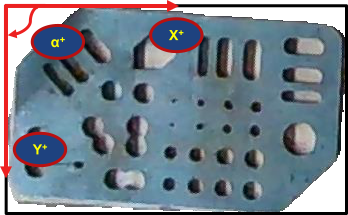
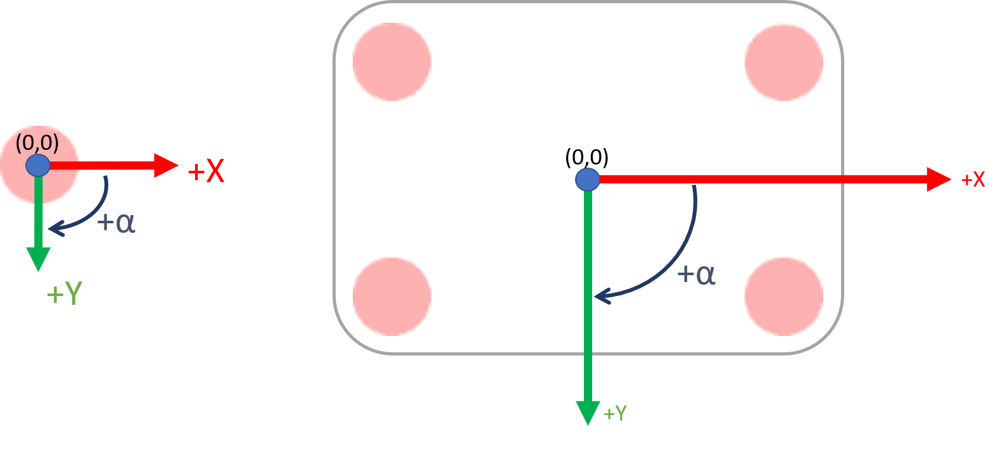
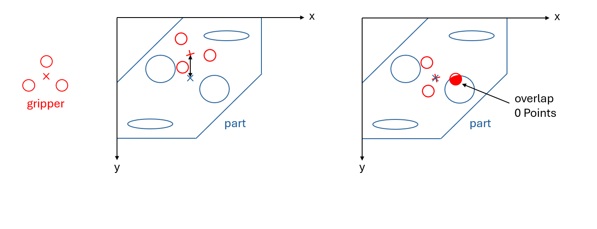

# Hackathon 2024

Welcome, and thank you for participating! This repository contains a skeleton for your submission to the Hackathon 2024.

## The Challenge

The challenge was presented during the kick-off meeting.
In short, the task is to find a good position and rotation for a robotic arm to grab a piece of cut sheet metal.

 


### Where is my data?

First off: The data is NOT to be made public. In particular, do not publicly upload the data to GitHub.

You should have received a link to a shared folder with the data in the kick-off.
Please add the data from the BWSync into `data/raw/` and `data/evaluate/`.

For example, `data/raw/part_1` now contains `part_1.png` for the part file and `gripper_2.png` for the gripper mask.
Each parts folder may contain several parts and gripper files, so you need to be able to compute matches for all of them.
Additionally, `data/evaluate/` also contains solutions for the evaluation.

We will run the final evaluation on a *different* dataset of a similar format, so make sure your solution is general enough to work on unseen data.
We might assess the effctivenss of your method on more challanging data if that helps to more clearly determine winners.

### Conventions in the data

A pixel in the mask and gripper files corresponds to 1mm in the real world. The gripper SVGs are also scaled accordingly.

The coordinates in an image are given in the following way:



Here, `x` ranges from `0` to `width`, and `y` ranges from `0` to `height`. The coordinates reference the borders between the pixels (edge/corner-based coordinates), so `(x, y) = (1, 0)` would be between the first and second pixels in the first row.

The angle `α` is given in degrees and ranges from `0` (inclusive) to `360` (exclusive). It is measured clockwise, with `0°` pointing to the right.

The positioning of the gripper shall always be given as its center point (and rotation around that point). So `(x, y, α) = (width/2, 0, 90)` would position the gripper in the center of the top edge of the image, pointing downwards.

 

## Your solution and the evaluation

You can either:
1. Use Python 3.12+ and the provided code skeleton to implement your solution. To get started, place your dependencies in `requirements.txt` and start coding in `solution/`. Your dependencies should be easy to install via pip. If that is not the case, see option 2.
2. Use your own tools and languages. In this case, provide us with a detailed description of how to run your code AND a `Dockerfile` where everything can run out of the box.

### The interface to your Code

To check if your code is working and to permit final grading, please make sure you provide the following:
Your solution must be a program with two strings as the calling arguments.
Firstly, it receives a CSV file containing the part and gripper image file names.
We might split the evaluation into multiple such calls to your program.
All paths are relative to the current working directory.
The input file will look like this:

```csv
part,gripper
part_1.png,gripper_5.svg
part_42.png,gripper_1.svg
```

Secondly, it receives an argument with a path to a folder where the results should be saved.
The output must look like this:

```csv
part,gripper,x,y,angle
part_1.png,gripper_5.svg,100,200,45
part_42.png,gripper_1.svg,300,400,90
```

You are more than welcome to add visualization images as well.
They might help you and us to understand your solution better.
You can simply return them as an additional `visualization` column in the CSV file.

In summary, your program needs to handle (for instance, with Python) `python solution/main.py path/to/input/tasks.csv output/solutions.csv`.
it should exit with a status code of `0` if everything went well and `1` in any other case.
Hint: In Python, the return code is always `0` anyway unless you explicitly call `sys.exit(1)` or an exception is raised.

### Runtime requirements

Your code needs to be able to run on a modern consumer desktop.
It may use a single GPU you'd typically find in such a machine (i.e., no high-end server GPUs).
The code may run for up to 3 seconds per part-gripper pair.
If it takes noticeably longer, we will deduct points from your score.

### Evaluation of your Code

To see if your program is running correctly, we provide a simple evaluation script.
It should work as long as your output follows the format described above.
You can run it by the following command:

```bash
python evaluate/eval.py
```

If you build something custom, you can also run it like this:

```bash
python evaluate/eval.py 'python solution/your/super/fancy/tool.py'
# Or
python evaluate/eval.py 'super_fast_assembly_solution'
```

**NOTE: This is currently a placeholder evaluation script. We will provide a complete evaluation on the actual data soon. It will also account for possibly ambigous solutions.**

### Evaluation Metrics

 


First and foremost: Please document which design decisions you took in solving the problem! The quality of your documentation and your design decisions will be the tie breaker between solutions with similar quality.

The quantitative evaluation will be as follows:
We will use an evaluation set of data, with similar but new parts to assess your solution.

- There must be no intersection between the gripper points and the edges or holes of the part. This is a hard constraint and will lead to 0 points if unfullfilled.
- Minimize the distance between the center of the gripper and the center of the part (approximated as the center of the image). Closer is better.

The following equation represents the optimization goal:

$$\text{Minimize: } \sqrt{(x_{gripper} - x_{part})^2 + (y_{gripper} - y_{part})^2}$$  

Subject to the constraint:  
$$\text{Intersection}(\text{Gripper Area}, \text{Part Edges or Holes}) = 0$$


Where:
- $\((x_{gripper}, y_{gripper})\)$ are the coordinates of the gripper center.
- $\((x_{part}, y_{part})\)$ are the coordinates of the part center.
- The intersection condition ensures that no part of the gripper overlaps with the edges or holes of the part. This is calculated using a part mask and geometric intersection checks. It is also why we need the angle in your results.


## License

All resources in this repository are licensed under the MIT License. See the [LICENSE](LICENSE) for more information.

We expect you to also license your code under the MIT License when submitting it.

## Acknowledgments


This project is partially funded by the German Federal Ministry of Education and Research (BMBF) within the “The Future of Value Creation – Research on Production, Services and Work” program (funding number 02L19C150) managed by the Project Management Agency Karlsruhe (PTKA).
The authors are responsible for the content of this publication.
